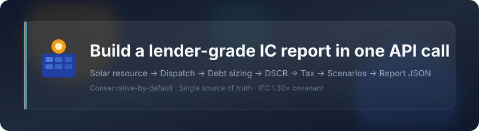
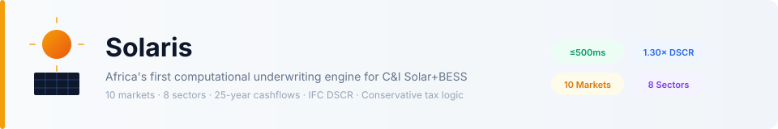
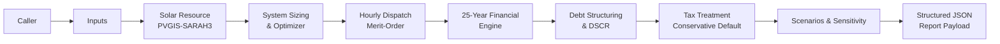
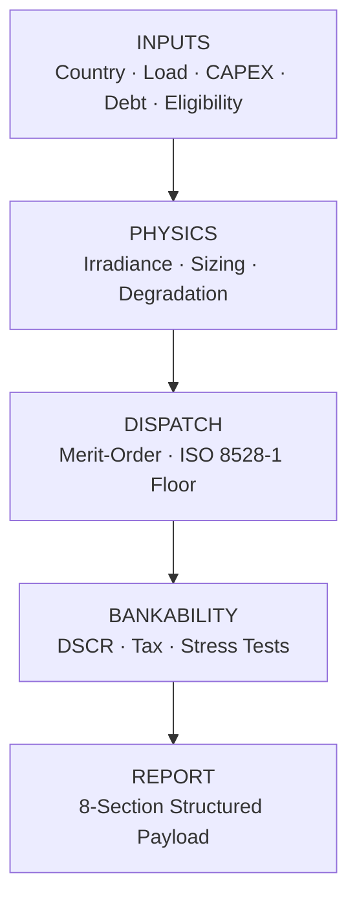
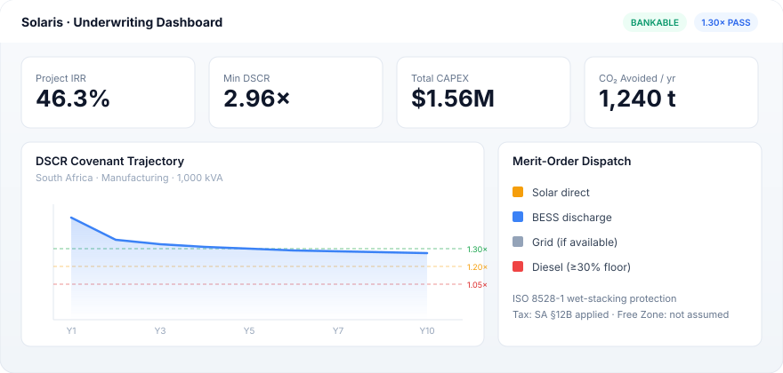

<p align="center">
  <picture>
    <source media="(prefers-color-scheme: dark)" srcset="./assets/hero-dark.svg">
    <source media="(prefers-color-scheme: light)" srcset="./assets/hero-light.svg">
    
  </picture>
</p>

<p align="center">
  
</p>

<p align="center">
  <b>Solaris</b><br />
  <sub>Deterministic Renewable Energy Underwriting · Africa C&I</sub>
</p>

<p align="center">
  <a href="#what-solaris-is"></a>
  <a href="#quickstart"></a>
  <a href="#api-reference"></a>
  <a href="https://www.researchgate.net/publication/410384861_A_Deterministic_Framework_for_CI_Solar-Diesel_Hybrid_Feasibility_Screening_in_Africa"></a>
  <a href="https://rapidapi.com/bethelnedi/api/diesel-to-solar-hybrid-feasibility-api-africa"></a>
</p>

<p align="center">
  
  
  
  
  
</p>

---

## Commercial product

Solaris is a **paid underwriting API**, not a free calculator and not open-source core.

| Tier | Price | Requests/month | Rate limit |
|:---|:---|---:|---:|
| **Basic** | $24.99/mo | 1,000 | 60/min |
| **Pro** | $49.99/mo | 5,000 | 90/min |
| **Pro Plus** | $99.99/mo | 15,000 | 120/min |
| **Premium** | $199.99/mo | 50,000 | 180/min |
| **Elite** | $499.99/mo | 200,000 | 240/min |

Every tier gets **full access to every endpoint** — the quick screen, the full 25-year model, DSCR covenant tables, scenario stress-testing, batch analysis, and the bankable report payload. There is no free tier and no feature reserved for a higher plan; tiers differ only by monthly request volume and per-minute rate limit. Live pricing and quotas: `GET /pricing`.

→ [Subscribe on RapidAPI](https://rapidapi.com/bethelnedi/api/diesel-to-solar-hybrid-feasibility-api-africa)
→ [Subscribe on Zyla API Hub](https://zylalabs.com/api-marketplace/sustainability+%26+green+tech/solaris+africa+hybrid+feasibility+api)

Docs and methodology are public. The calculation engine is commercial.

---
<br />

## What Solaris is

> **Most Solar APIs say**  
> *“We’ll size your PV.”*  
>
> **Solaris says**  
> *“We’ll tell you whether a bank should finance this project.”*

Solaris is Africa’s first **computational underwriting engine** for commercial & industrial Solar + BESS projects. It does not stop at technical sizing. It produces lender-grade outputs: 25-year cashflows, full DSCR covenant tables, conservative-by-default tax treatment, scenario stress tests, and structured report payloads — in a single API call.

The philosophy is simple and non-negotiable:

| Principle | What it means in practice |
|:---|:---|
| **Conservative-by-default** | Approval-gated incentives (Free Zone, Pioneer Status, SEZ) are **never** assumed. They apply only when the caller explicitly confirms eligibility. |
| **Single source of truth** | Any value referenced more than once is computed once. Summary fields, covenant tables, and report sections cannot silently disagree. |
| **Lender-legible** | Outputs are structured the way a project-finance officer actually reads them — not the way an engineer optimizes a dispatch curve. |
| **Fully cited** | Every quantitative assumption traces to a primary standard (ISO, NREL, IFC, IRENA, national statutes). |

This is not a documentation-first science project. It is product-first infrastructure for investment decisions.

<br />

<p align="center">
  
</p>

<br />

---

<br />

## Why this exists

Two categories of tooling currently serve C&I diesel-to-solar conversion in Africa. Both have a well-documented failure mode:

| Tool class | Strength | Failure mode |
|:---|:---|:---|
| Generic dispatch simulators (HOMER-class) | High-fidelity technical optimization | Do not produce DSCR covenant tables, IFC-aligned underwriting, or PPA/EaaS dual-mode structuring |
| Bespoke spreadsheets | Easily adapted to local conventions | Calculation logic is duplicated; discretionary tax incentives are often assumed unconditionally; results are rarely auditable |

Solaris closes the gap between “technically feasible” and “bankable under standard commercial debt terms.”

<br />

---

<br />

## Platform metrics

| Metric | Value | Source |
|:---|---:|:---|
| Median response latency | ≤ 500 ms | Production engine |
| Project horizon | 25 years | Standard DFI convention |
| Supported markets | 10 African countries | Localized fuel, tax, irradiance, grid |
| Supported sectors | 8 C&I load profiles | Hourly solar-coincidence shapes |
| Lender covenant floor | 1.30× DSCR | IFC / World Bank ESMAP |
| Lock-up threshold | 1.20× | Distribution restriction |
| Default breach | 1.05× | Covenant default |

<br />

<p align="center">
  <picture>
    <source media="(prefers-color-scheme: dark)" srcset="./assets/banner-dark.svg">
    <source media="(prefers-color-scheme: light)" srcset="./assets/banner-light.svg">
    
  </picture>
</p>

<br />

---

<br />

## Feature cards

<table>
<tr>
<td width="50%" valign="top">

### ⚡ Dispatch Engine

Hourly merit-order sequence:

```text
Solar direct → BESS discharge → Grid → Diesel
```

Hard constraint: **≥ 30 % partial-load floor** on the diesel generator at every dispatch hour (ISO 8528-1 wet-stacking protection).

</td>
<td width="50%" valign="top">

### 🏦 Project Finance

- 25-year annual cashflow schedule  
- NPV & IRR (standard DCF)  
- Debt sized against **gross** project CAPEX  
- Tax benefit modeled as Year-1 addback (not capital-base reduction)  
- Full DSCR covenant table across the entire loan tenor

</td>
</tr>
<tr>
<td width="50%" valign="top">

### 🌍 Market Intelligence

Localized parameters for:

**Nigeria · South Africa · Kenya · Ghana · Egypt · Tanzania · Ethiopia · Zambia · Senegal · Morocco**

Fuel indices, irradiance (PVGIS-SARAH3), grid reliability, sovereign tax codes.

</td>
<td width="50%" valign="top">

### 🧾 Conservative Tax Logic

| Category | Treatment |
|:---|:---|
| General election (e.g. SA §12B) | Applied automatically |
| Discretionary / approval-gated (Pioneer Status, Free Zone) | **Only** when caller confirms eligibility |

Default assumption: **no discretionary benefit**.

</td>
</tr>
</table>

<br />

---

<br />

## Architecture



Every value that appears in more than one output section is computed on a **single calculation path**. This architectural choice is the direct result of a structured internal-consistency audit that identified (and eliminated) independently re-derived values that previously produced silent disagreements inside the same report.

<br />

---

<br />

## Product pipeline



This is the framing that matters: a product pipeline that ends in an investment decision, not a spreadsheet cell.

<br />

---

<br />

## Key outputs

- Optimized Solar PV + BESS capacity  
- Hourly merit-order dispatch with diesel thermal health constraints  
- IRR, NPV, payback, LCOE, 25-year cashflow tables  
- Full DSCR covenant trajectory (every year of the loan tenor)  
- Year-1 DSCR **and** tenor-governing minimum DSCR (with the year it occurs)  
- Conservative treatment of discretionary tax incentives  
- One-way sensitivity (diesel price, CAPEX, discount rate)  
- Three-scenario stress test (Conservative / Base / Optimistic)  
- Carbon offsets (Verra VCS / Gold Standard pathways)  
- Structured 8-section payload ready for headless PDF generation  

<br />

---

<br />

## Endpoints

Every endpoint below is available on every paid tier — see [Commercial product](#commercial-product) above.

| Endpoint | Feels like | Purpose |
|:---|:---|:---|
| `GET /health` | Status card | Version, uptime, supported markets |
| `GET /pricing` | Commercial plan view | Tier & quota transparency across all marketplaces |
| `POST /analyse/quick` | Instant feasibility screen | Lean summary — sizing, IRR, payback, DSCR pass/fail |
| `POST /analyse/full` | Institutional underwriting | Full 25-year model, DSCR covenant table, sensitivity, tax flags |
| `POST /analyse/batch` | Portfolio screen | Multiple sites in one call, ranked by IRR |
| `POST /analyse/bankable` | Report generator | 8-section PDF-ready structured payload |
| `POST /analyse/scenarios` | Investment committee view | Conservative / Base / Optimistic decision tags |
| `POST /analyse/ppa` | EaaS dual-mode | Developer IRR + break-even tariff via bisection NPV root |
| `POST /screen/country` | Sector ranking | All 8 load profiles ranked by bankable IRR, one country |
| `POST /compare/countries` | Country matrix | Same sector across 2–10 markets, ranked by IRR |
| `POST /screen/es-checklist` | E&S pre-screen | IFC Performance Standards checklist, Category A/B, DFI eligibility |
| `POST /site/irradiance` | Site-specific yield | PVGIS-SARAH3 lookup by lat/lon — replaces country-average irradiance |
| `GET /reference/countries` | Market data table | All 10 countries — irradiance, diesel price, incentives, sources |
| `GET /reference/load-profiles` | Sector data table | All 8 load profiles — solar coincidence, BESS benefit factor |
| `GET /reference/capex-benchmarks` | Cost basis table | PV/BESS capex, O&M rates, degradation, cycle life assumptions |
| `GET /reference/methodology` | Citation index | Every standard/paper cited in the engine, by calculation step |
| `GET /reference/changelog` | Version history | What changed between engine versions and why |

<br />

---

<br />

## Quickstart

```bash
# Install
pip install requests
```

```python
import requests

url = "https://diesel-to-solar-hybrid-feasibility-api-africa.p.rapidapi.com/analyse/quick"

headers = {
    "Content-Type": "application/json",
    "X-RapidAPI-Key": "YOUR_RAPIDAPI_KEY",
    "X-RapidAPI-Host": "diesel-to-solar-hybrid-feasibility-api-africa.p.rapidapi.com"
}

payload = {
    "country": "nigeria",
    "load_profile": "manufacturing",
    "avg_daily_load_kwh": 2400,
    "nameplate_kva": 500,
    "load_fraction": 0.75,
    "target_diesel_displacement_pct": 70,
    "backup_hours_target": 4
}

data = requests.post(url, json=payload, headers=headers).json()

print(f"Project IRR          : {data['summary']['irr_pct']}%")
print(f"LCOE Solar+BESS      : ${data['summary']['lcoe_solar_bess_usd_kwh']}/kWh")
print(f"Lender bankable      : {data['summary']['dscr_lender_pass']}")
print(f"CO₂ avoided / year   : {data['summary']['co2_saved_tonnes_yr']} t")
```

<details>
<summary><strong>Example response (truncated)</strong></summary>

```json
{
  "summary": {
    "irr_pct": 21.3,
    "payback_years": 5,
    "lcoe_solar_bess_usd_kwh": 0.0586,
    "diesel_allin_usd_kwh": 0.2411,
    "dscr_lender_pass": true,
    "co2_saved_tonnes_yr": 613
  }
}
```

</details>

<br />

---

<br />

## API Reference

<details>
<summary><strong>POST /analyse/quick</strong> — Lender-grade feasibility snapshot in seconds</summary>

```http
POST /analyse/quick
Content-Type: application/json
```

```json
{
  "country": "nigeria",
  "load_profile": "manufacturing",
  "avg_daily_load_kwh": 2400,
  "nameplate_kva": 500,
  "load_fraction": 0.75,
  "target_diesel_displacement_pct": 70,
  "backup_hours_target": 4
}
```

Returns baseline diesel metrics, optimized PV+BESS sizing, dispatch summary, IRR/NPV/payback, DSCR pass/fail, carbon, and land footprint. It's the lean summary by design — the full 25-year cashflow schedule is in `/analyse/full`, available on every paid tier.

</details>

<details>
<summary><strong>POST /analyse/full</strong> — Complete institutional underwriting model</summary>

```http
POST /analyse/full
Content-Type: application/json
```

```json
{
  "country": "south_africa",
  "load_profile": "manufacturing",
  "avg_daily_load_kwh": 4800,
  "nameplate_kva": 1000,
  "load_fraction": 0.75,
  "target_diesel_displacement_pct": 75,
  "backup_hours_target": 6,
  "debt_fraction_pct": 70,
  "loan_tenor_yr": 10,
  "interest_rate_pct": 12.0,
  "pioneer_status_confirmed": false,
  "free_zone_registered": false
}
```

Adds the uncompressed 25-year cashflow schedule, non-linear BESS SOH curves, configurable debt parameters, grid-downtime micro-simulation, custom irradiance overrides, and explicit eligibility flags for discretionary incentives.

</details>

<details>
<summary><strong>POST /analyse/scenarios</strong> — Investment-committee stress test</summary>

Returns three parallel cases (Conservative P90, Base P50, Optimistic) and reports **both** Year-1 DSCR and the tenor-minimum DSCR (with the year it occurs). A strong opening year cannot mask a later covenant breach.

Decision tags: `INVEST` · `PROCEED WITH CONDITIONS` · `MARGINAL` · `DO NOT PROCEED`

</details>

<details>
<summary><strong>POST /analyse/bankable</strong> — Report-ready structured payload</summary>

Emits an 8-section typed JSON package engineered for headless PDF layers (ReportLab, WeasyPrint, Puppeteer):

1. Executive Summary  
2. Country Economic Context  
3. Engineering Design  
4. Financial Model  
5. Debt Structuring (with explicit methodology note on tax-benefit timing)  
6. Asset Risks  
7. ESG Metrics  
8. Source Citations  

</details>

<details>
<summary><strong>POST /screen/country</strong> — Sector ranking inside one market</summary>

Runs all 8 load profiles and ranks by financial performance. The top recommendation is the highest-IRR sector that also clears the DSCR covenant. If the highest-IRR sector fails DSCR, that is flagged explicitly rather than recommended.

</details>

<br />

---

<br />

## Dashboard preview

<p align="center">
  <picture>
    <source media="(prefers-color-scheme: dark)" srcset="./assets/dashboard-dark.svg">
    <source media="(prefers-color-scheme: light)" srcset="./assets/dashboard-light.svg">
    
  </picture>
</p>

<br />

---

<br />

## Real outputs

### Nigeria — sector screen (standardized 500 kVA site)

```text
commercial_office      IRR: 24.9%  |  DSCR: PASS
agro_processing        IRR: 23.4%  |  DSCR: PASS
manufacturing          IRR: 21.3%  |  DSCR: PASS
retail_mall            IRR: 15.9%  |  DSCR: FAIL
cold_chain             IRR: 13.9%  |  DSCR: FAIL
hospital               IRR: 13.2%  |  DSCR: FAIL
telecoms_tower         IRR: 13.1%  |  DSCR: FAIL
hotel                  IRR: 12.0%  |  DSCR: FAIL
```

Daytime solar coincidence is a first-order driver of required CAPEX and bankability at fixed displacement targets.

### South Africa — manufacturing case study (1 000 kVA)

| Metric | Value |
|:---|---:|
| Total CAPEX | $1 556 723 |
| Year-1 tax benefit (§12B) | $420 315 |
| Project IRR | 46.3 % |
| 25-year NPV | $4 986 480 |
| Year-1 DSCR | 5.06× |
| Tenor-governing min DSCR | 2.96× (Year 2) |

Both clear the 1.30× IFC floor. The covenant table makes the full trajectory visible rather than reporting Year 1 alone.

<br />

---

<br />

## Comparison

| | Solaris | Generic feasibility tools |
|:---|:---|:---|
| Primary focus | Lender-grade underwriting | Technical sizing |
| Tax treatment | Conservative-by-default; eligibility gated | Often assumed automatically |
| DSCR output | Full year-by-year covenant table | Summary or Year-1 only |
| Output form | Structured JSON for automation | Spreadsheet exports |
| Market design | Built for African C&I | Generic or single-market |
| Consistency | Single calculation path + regression suite | Frequently duplicated logic |

<br />

---

<br />

## Methodology

Solaris implements the deterministic framework documented in:

> **Nedi, T. (2026).** *A Deterministic Framework for C&I Solar-Diesel Hybrid Feasibility Screening in Africa.* Axiom Infrastructure Intelligence.  
> [Read on ResearchGate →](https://www.researchgate.net/publication/410384861_A_Deterministic_Framework_for_CI_Solar-Diesel_Hybrid_Feasibility_Screening_in_Africa)

Key design decisions:

1. **Debt sized against gross CAPEX** — construction is financed at full cost before any tax benefit is realized (standard DFI/IFC convention).  
2. **Tax benefit as Year-1 operating cash-flow addback** — not a reduction of the capital base. Consequence: Year-1 DSCR is frequently the strongest year; the tenor-governing minimum typically appears in Year 2.  
3. **Discretionary incentives never assumed** — Free Zone / Pioneer Status / SEZ status require explicit caller confirmation.  
4. **Single source of truth** — every value that appears in more than one place is computed once and referenced everywhere. A structured audit identified five distinct instances of independently re-derived values; all were consolidated and protected by a 15-test regression suite.

### Primary standards

| Component | Governing source |
|:---|:---|
| Diesel fuel curves | ISO 8528-1:2005 §13 |
| Solar resource | PVGIS-SARAH3 · Fraunhofer ISE PV Report 2024 |
| PV sizing | Neubauer & Simpson (2015) NREL/TP-5400-63162 |
| PV degradation | Jordan & Kurtz (2013) NREL/TP-5200-51664 |
| BESS cost & LCOS | NREL ATB 2024 · Mongird et al. (2022) PNNL-33283 |
| Dispatch logic | Lambert et al. (2006) HOMER merit-order |
| Financial structuring | IRENA (2023) · IFC (2023) |
| DSCR underwriting | IFC 1.30× · World Bank ESMAP (2022) |
| Carbon accounting | Verra VCS VM0038 · Gold Standard AMS-I.D. |

<br />

---

<br />

## Scope & limitations

This is a **pre-feasibility screening framework**. It is not a substitute for:

- Licensed electrical engineering design (IEC 62548 / NEC 690)  
- Structural or geotechnical assessment  
- Independent financial and legal due diligence  
- Project-specific negotiated tax rulings  

Resource assessment uses P50 benchmark irradiance with a P90 stress case, not full Monte-Carlo simulation. General-election tax rates are modeled at statutory levels.

<br />

---

<br />

## Closing

**Build faster. Screen smarter. Finance better.**

Solaris turns renewable-energy feasibility into a product that investors can trust and developers can present with confidence.

> [!CAUTION]
> All outputs are pre-feasibility estimates optimized for initial site screening and market discovery. Project proponents must commission a licensed electrical engineer and a registered financial adviser prior to final procurement or capital allocation.

---

<p align="center">
  <a href="https://rapidapi.com/bethelnedi/api/diesel-to-solar-hybrid-feasibility-api-africa"></a>
  &nbsp;
  <a href="https://www.researchgate.net/publication/410384861_A_Deterministic_Framework_for_CI_Solar-Diesel_Hybrid_Feasibility_Screening_in_Africa"></a>
</p>

<p align="center">
  <sub>© 2026 Axiom Infrastructure Intelligence · Solaris Engine v1.0.0</sub>
</p>
